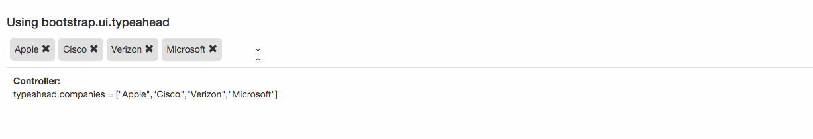

# Angular-Chips

Angular-Chips is the angular based component. You can use it to add dynamic chips or free form tags. check samples directory for more information.

### Install:

`bower install angular-chips --save-dev`

Include after angular.js script tag

``

``

Include in you application module.

`angular.module('sample',['angular.chips']);`

<a href="http://blog.imaginea.com/angular-chips-documentation/" target="_blank"><h3>Documentation</h3></a>

### Examples:

<a href="http://codepen.io/mohbasheer/pen/RaRQxN" target="_blank"><h3>codepen link</h3></a>

<a href="http://codepen.io/mohbasheer/pen/pybLNx" target="_blank"><h3>codepen link</h3></a>

<a href="http://codepen.io/mohbasheer/pen/XdKEpL" target="_blank"><h3>codepen link</h3></a>

<a href="http://codepen.io/mohbasheer/pen/YqWaQN" target="_blank"><h3>codepen link</h3></a>

<a href="http://codepen.io/mohbasheer/pen/JXKLyY" target="_blank"> <h3>codepen link</h3> </a>

